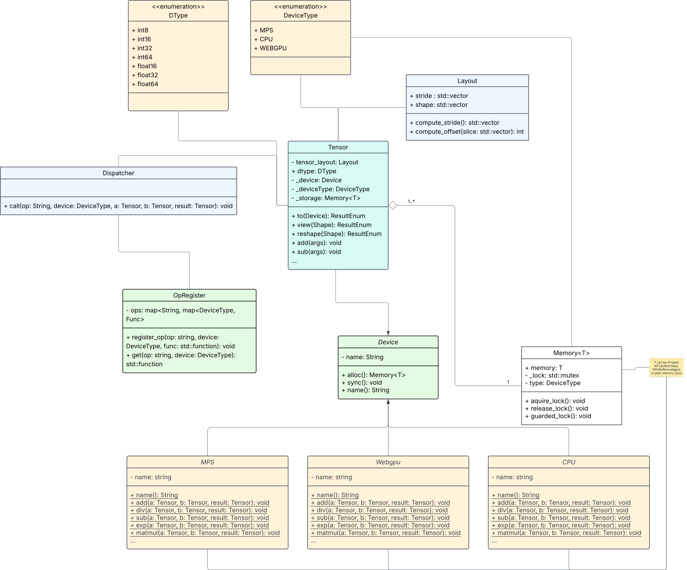

# Class Diagram




# Sync() 
`sync()` is a deceptively simple but crucial part of a device backend. It ensures that **asynchronous operations on a device complete before proceeding** — especially important for GPU backends like Metal and WebGPU.

Let’s walk through what `sync()` means and how to implement it per device:

---

## 🔁 `sync()` — Concept

```cpp
virtual void sync() = 0;
```

### ✅ When to call it:
- Before reading back from GPU to CPU
- Before measuring performance
- For deterministic behavior in testing/debugging

---

## 🧠 Per Device Backend

### 🖥️ **CPU**
CPU ops are synchronous (unless you're threading manually), so:

```cpp
void CPU::sync() override {
    // No-op
}
```

---

### 🧲 **MPS (Metal Performance Shaders)**

Metal is *asynchronous* by design. You submit a `MTLCommandBuffer` to the GPU queue — it may execute *later*.

```cpp
void MPS::sync() override {
    commandBuffer->commit();
    commandBuffer->waitUntilCompleted();
}
```

- `commit()` submits the buffer
- `waitUntilCompleted()` blocks the CPU until GPU finishes

If you reuse command buffers, ensure each op creates or reuses one safely.

---

### 🌐 **WebGPU**

WebGPU also runs operations async via command queues. You’d typically:

```cpp
void WebGPU::sync() override {
    queue.onSubmittedWorkDone().await();  // pseudo-code
}
```

In practice, you'd have to use:
- `queue.submit([commands])`
- Then use the JS `GPUQueue.onSubmittedWorkDone()` promise, wrapped in native async logic.

In native C++ or Rust via Dawn/WGPU:
```cpp
void WebGPU::sync() override {
    device->Poll(true); // blocks until GPU queue is idle
}
```

---

## 🧩 Where You Use `sync()`

### Example: Reading tensor from GPU to CPU
```cpp
Tensor t = tensor_on_gpu;
t.device()->sync();
void* cpu_data = t.to_cpu().data();
```

### Example: Testing
```cpp
add(t1, t2);
t1.device()->sync();
assertEqual(t1.data(), expected);
```

---

## 🧠 Bonus Tips

- Keep `sync()` lightweight when possible (no full flush unless needed)
- Use it inside `.to_cpu()` conversions
- Provide `device->async()` or `stream()` if supporting advanced execution control later

---


# Dispatcher Logic
this is an important decision, and both **registry-based dispatch** and **virtual-method-based dispatch (via abstract base class)** are valid. Let’s explore both in depth with pros, cons, and when to use each.

---

## 🧭 Option 1: **Virtual Method Dispatch (OOP-style)**

### ✅ How it works

Each device (like `CPU`, `MPS`, `WebGPU`) inherits from an abstract `Device` class and **overrides** methods like `add`, `sub`, etc.

```cpp
class Device {
public:
    virtual Tensor add(const Tensor& a, const Tensor& b) = 0;
};

class CPU : public Device {
public:
    Tensor add(const Tensor& a, const Tensor& b) override;
};
```

Then you call:
```cpp
a.device()->add(a, b);
```

---

### ✅ Pros

- **Elegant** and **polymorphic** — code is easy to reason about
- Automatically dispatches based on object type (`virtual` dispatch)
- Keeps device-specific logic isolated

### ❌ Cons

- **Rigid**: You must define all ops in the abstract base class
- Hard to **dynamically register** new ops or backends
- Adding an op means updating every subclass (unless you use `default` impls)

---

## 🧭 Option 2: **Op Registry Dispatch (Data-driven)**

### ✅ How it works

Operations are registered at runtime in a global registry, indexed by `(op_name, device_name)`.

```cpp
OpRegistry::register_op("add", "cpu", &CPU::add);
```

Then when you want to perform an operation:

```cpp
auto fn = OpRegistry::get("add", a.device()->name());
Tensor result = fn(a, b);
```

---

### ✅ Pros

- **Extensible**: Easy to register new ops/devices/plugins at runtime
- **Decoupled**: Logic is not tightly bound to class hierarchy
- Perfect for ops that are **independent functions**, like `sin`, `matmul`, `conv2d`

### ❌ Cons

- Slightly more **boilerplate**
- Can be harder to navigate: no clear class-based organization
- Need to manage registry lifetimes carefully

---

## 📌 Suggested Hybrid Architecture (Best of Both Worlds)

Many modern ML libraries (like PyTorch) use a **hybrid** approach:

- Devices implement core memory + execution APIs via abstract class:
  
  ```cpp
  class Device {
      virtual Memory<T> alloc(size_t size) = 0;
      virtual void sync() = 0;
      std::string name();  // "cpu", "mps", etc
  };
  ```

- All **ops** are dispatched through a global **OpRegistry**:
  
  ```cpp
  add(a, b) → OpRegistry["add"][a.device()->name()](a, b)
  ```

This separation lets you:
- Keep device management modular (via `Device`)
- Make op registration dynamic and data-driven

---

## 🧩 What I Recommend for You

Since you're building a **PyTorch-like system**:

| Concern                          | Recommendation      |
|----------------------------------|----------------------|
| Core memory management, sync     | ✅ Use abstract `Device` class |
| Operation dispatch               | ✅ Use `OpRegistry` |
| Extending ops/devices later      | ✅ Registry scales better |
| Want per-device custom logic     | 🔄 Use lambdas or bound member functions in registry |

---

### Bonus: What PyTorch Does

PyTorch uses something like:

- `TensorImpl` holds device + dispatch keys
- C++ `DispatchStub` uses hashmaps for kernel lookup
- Separate "device context" and "operation registry"

It's closer to a **registry-style system with polymorphic helpers**.

---

# Dispatcher <-> Tensor Logic
Absolutely — here’s a clear C++-like pseudocode snippet showing:

- How `Tensor::add()` calls `Dispatcher`
- How `Dispatcher` uses `OpRegistry` to get the right backend function

---

## 🧱 Step-by-Step Components

### 1. `Tensor` (User API layer)

```cpp
class Tensor {
public:
    Device* device;
    void* data;
    Shape shape;
    DType dtype;

    Tensor add(const Tensor& other) const {
        return Dispatcher::call("add", *this, other);
    }
};
```

---

### 2. `Dispatcher` (Central dispatch layer)

```cpp
class Dispatcher {
public:
    static Tensor call(const std::string& op, const Tensor& a, const Tensor& b) {
        std::string device_name = a.device->name();  // e.g., "cpu", "mps"
        auto op_fn = OpRegistry::get(op, device_name);
        return op_fn(a, b);  // Call the actual function
    }
};
```

---

### 3. `OpRegistry` (Global registry of all op-device implementations)

```cpp
using OpFunc = std::function<Tensor(const Tensor&, const Tensor&)>;

class OpRegistry {
    static inline std::unordered_map<std::string,
        std::unordered_map<std::string, OpFunc>> registry;

public:
    static void register_op(const std::string& op_name, const std::string& device_name, OpFunc fn) {
        registry[op_name][device_name] = fn;
    }

    static OpFunc get(const std::string& op_name, const std::string& device_name) {
        return registry.at(op_name).at(device_name);
    }
};
```

---

### 4. Registering device-specific ops

```cpp
namespace CPU {
    Tensor add(const Tensor& a, const Tensor& b) {
        // Actual CPU addition logic here
        return result;
    }
}

void init_ops() {
    OpRegistry::register_op("add", "cpu", &CPU::add);
    // Register more ops and devices similarly
}
```

---

### ✅ Usage

```cpp
init_ops();  // Register all ops at startup

Tensor A = ...;  // on CPU
Tensor B = ...;

Tensor C = A.add(B);  // Dispatches to CPU::add via Dispatcher → OpRegistry
```

---

